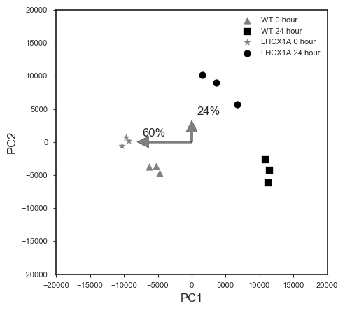
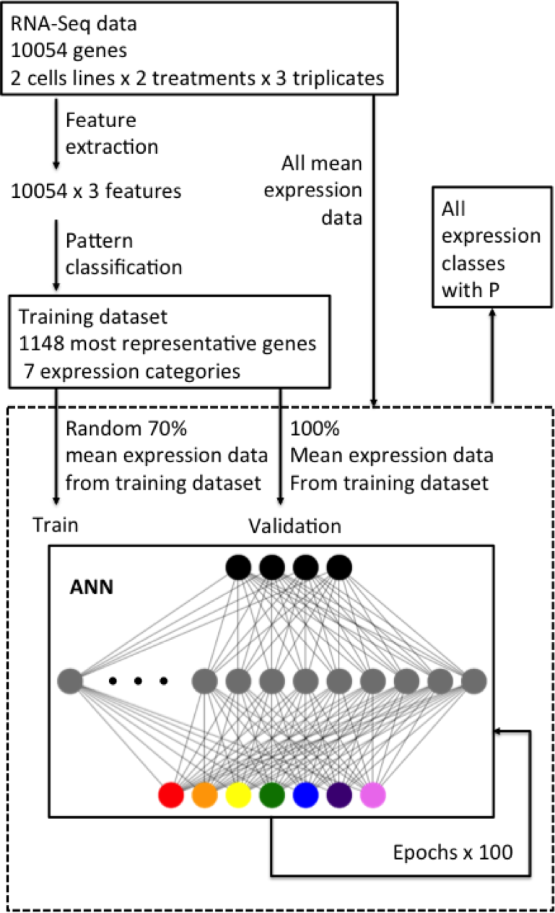
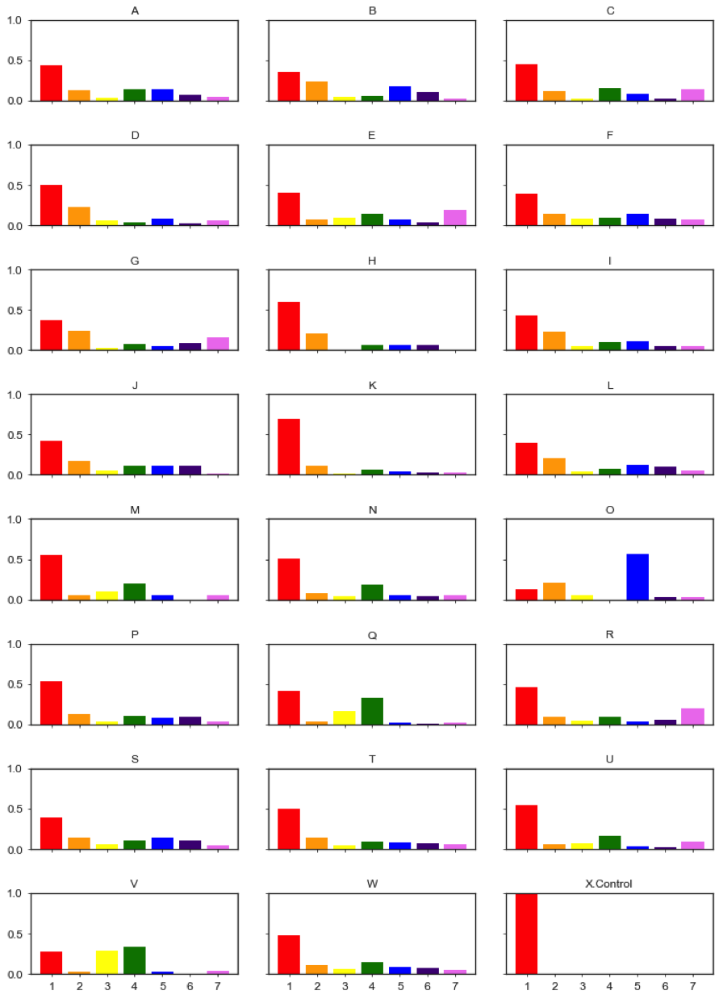
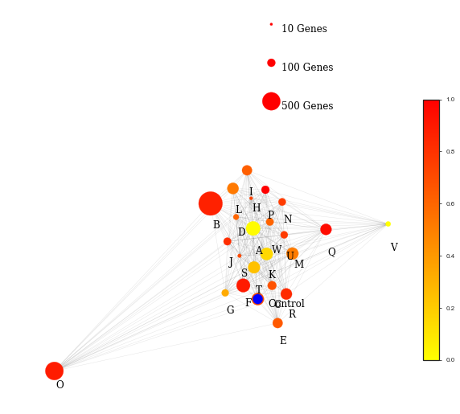

# Deep-learning-Expression-pattern

RNA-Seq data from two factors experiment design are sometimes difficult to analyze, because commonly available tools are designed for comparing time series data with one factor. In this case, the experiment was conducted with two factors, high light exposure time and cell line (WT vs. LHCX1).

</img>

By implementing an neural network, we can manually pre-define the expression pattern and select from the results a representative dataset that we used for traning and validation. 

</img>

Based on the gene functions, we count the number of different experssion patterns for each group. 

</img>

##### Gene expression patterns break down by pathways generated from trained ANN model classifier.  'A': 'Amino acid transport and metabolism',  'B': 'Carbohydrate transport and metabolism',  'C': 'Cell cycle control, cell division, chromosome partitioning',  'D': 'Cell wall/membrane/envelope biogenesis',  'E': 'Chromatin structure and dynamics',  'F': 'Coenzyme transport and metabolism',  'G': 'Cytoskeleton',  'H': 'Defense mechanisms',  'I': 'Energy production and conversion',  'J': 'Inorganic ion transport and metabolism',  'K': 'Intracellular trafficking, secretion, and vesicular transport',  'L': 'Lipid transport and metabolism',  'M': 'Nuclear structure',  'N': 'Nucleotide transport and metabolism',  'O': 'Photosynthesis',  'P': 'Posttranslational modification, protein turnover, chaperones',  'Q': 'RNA processing and modification',  'R': 'Replication, recombination and repair',  'S': 'Secondary metabolites biosynthesis, transport and catabolism',  'T': 'Signal transduction mechanisms',  'U': 'Transcription',  'V': 'Translation, ribosomal structure and biogenesis',  'W': 'Unknown', 'X': 'Control'. 

Finally, by calculating the distances between different function groups, we can figure out which functional groups have been most singificantly affected by the target factor with regarding to the change due to the other factor; in this case we target the factor cell line, and aim to figure out what function does knockouting out LHCX1 gene affect the most, regarding to the variant high light exposure time. 

</img>

It seems photosynthesis has been significantly affected by the knock out LHCX1 gene in response to high light exposure time.
Details about this work can be found in [LHCX_report](./LHCX_report.pdf)
